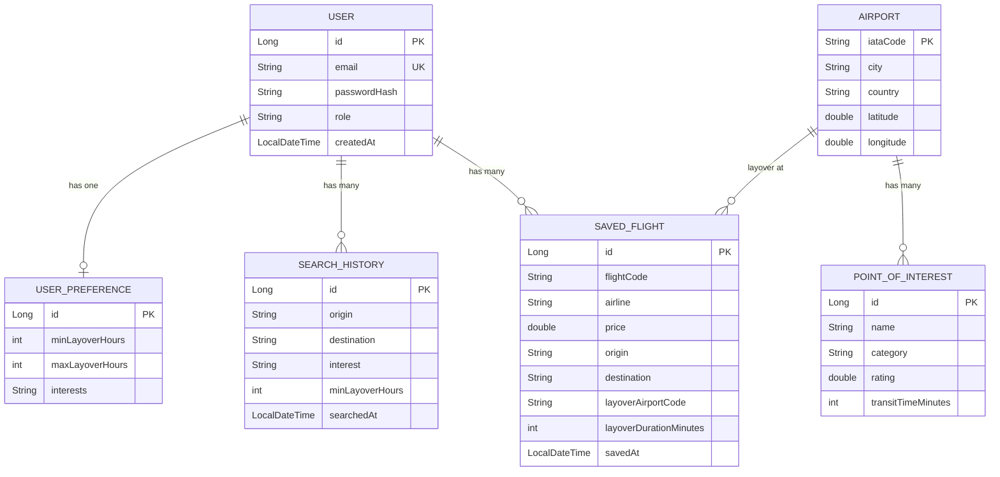
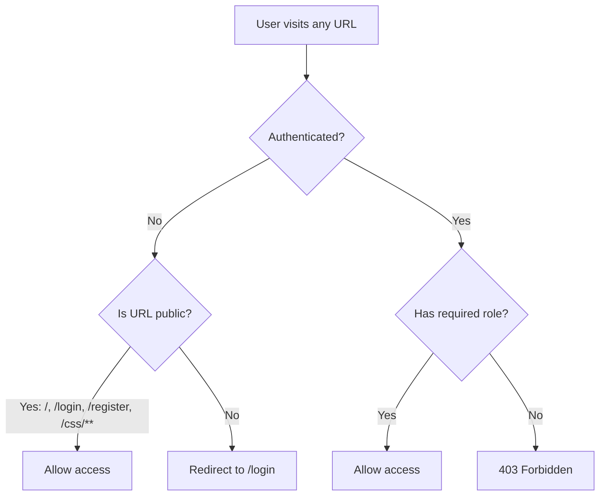

# Layover Explorer — Spring Boot MVC Migration: Master Architecture Plan

## Background

The current application is a Node.js/Express backend (port 3001) with a React/Vite frontend (port 5174). All flight data is hardcoded in `MockFlightService.js`, POI data in `MockPoiService.js`, and the database is SQLite with 4 tables (Users, UserPreferences, Airports, SearchHistory). The university assignment ("ex3") requires a complete rewrite to a **Spring Boot MVC monolith** using Thymeleaf, JPA/MySQL, Spring Security, and Spring Sessions.

---

## User Review Required

> [!IMPORTANT]
> **MySQL Prerequisite:** You must have MySQL Server installed and running locally. The application will connect to a database named `ex4`. You will need to create this database manually before first run:
> ```sql
> CREATE DATABASE IF NOT EXISTS ex4;
> ```

> [!IMPORTANT]
> **Project Location:** The new Spring Boot project will be created as a new directory `spring-backend/` inside the existing workspace (`layover-explorer/spring-backend/`). The old Node.js `backend/` folder will remain untouched for reference.

> [!NOTE]
> **No SPA page.** The React frontend is being retired entirely. All 7 pages will be server-side rendered with Thymeleaf — no client-side routing, no React build step.

---

## Confirmed Configuration

- **MySQL credentials:** `root` / `password`
- **Server port:** `8080`
- **Database name:** `ex4`
- **SPA:** Removed — fully Thymeleaf SSR

---

## Part 1: Architectural Theory & Justifications

### 1.1 Why Layered Architecture (N-Tier)?

The university requirement enforces separation of concerns. We split the application into 4 strict horizontal layers:

```
┌─────────────────────────────────────────────┐
│          Presentation Layer                 │
│   Controllers + Thymeleaf Views             │
│   (Handles HTTP, sessions, view routing)    │
├─────────────────────────────────────────────┤
│          Service Layer                      │
│   Business Logic Beans                      │
│   (Layover calculation, scoring, auth)      │
├─────────────────────────────────────────────┤
│          Repository Layer                   │
│   Spring Data JPA Interfaces                │
│   (CRUD abstraction over MySQL)             │
├─────────────────────────────────────────────┤
│          Domain / Entity Layer              │
│   JPA Entities (POJOs mapped to tables)     │
│   (User, Airport, PointOfInterest, etc.)    │
└─────────────────────────────────────────────┘
```

**Why this matters:**
- **Single Responsibility Principle (SRP):** Each layer has exactly one job. Controllers don't query the database. Repositories don't calculate scores. Services don't render HTML.
- **Dependency Inversion Principle (DIP):** Controllers depend on `Service` interfaces (injected via constructor), not on concrete implementations. Services depend on `Repository` interfaces provided by Spring Data JPA, not on raw JDBC or SQL.
- **Open/Closed Principle (OCP):** If we later swap from mock data to a real API (e.g., Amadeus), we only change the Service implementation — Controllers and Repositories don't change.
- **Testability:** Each layer can be unit-tested independently by mocking the layer below it.

### 1.2 Why MVC (Model-View-Controller)?

Spring MVC is the framework's core pattern:

| Component | Our Implementation | Responsibility |
|---|---|---|
| **Model** | JPA Entities + DTOs added to `Model` | Carries data from controller to view |
| **View** | Thymeleaf `.html` templates | Renders the UI using model data |
| **Controller** | `@Controller` classes | Receives HTTP requests, calls services, populates model, returns view name |

**Key Rule:** Controllers never contain business logic. They are "traffic cops" — they route requests and delegate work.

### 1.3 Why Constructor Injection Over Field Injection?

```java
// ❌ Field injection (hidden dependency, hard to test)
@Autowired
private FlightService flightService;

// ✅ Constructor injection (explicit, immutable, testable)
private final FlightService flightService;
public FlightController(FlightService flightService) {
    this.flightService = flightService;
}
```

- Makes dependencies **explicit** — you see what a class needs just by reading the constructor.
- Enables **immutability** (`final` fields) — the dependency cannot be swapped at runtime.
- Makes **unit testing trivial** — pass a mock directly via the constructor, no reflection tricks needed.
- Aligns with **DIP** — the constructor accepts an interface, not a concrete class.

---

## Part 2: JPA Entity Design & Relationships

### 2.1 Entity-Relationship Diagram



### 2.2 Entity Details & Relationship Justifications

#### Entity 1: `User`
- **Fields:** `id`, `email` (unique), `passwordHash`, `role` (USER/ADMIN), `createdAt`
- **Relationships:**
  - `@OneToOne` → `UserPreference` (a user has exactly one preference profile)
  - `@OneToMany` → `SearchHistory` (a user can perform many searches)
  - `@OneToMany` → `SavedFlight` (a user can save many flights to their cart)
- **Normalization:** User identity data is separated from preferences and activity data. This is **2NF** — non-key attributes depend on the whole key, not on each other.

#### Entity 2: `UserPreference`
- **Fields:** `id`, `minLayoverHours`, `maxLayoverHours`, `interests` (stored as comma-separated string, e.g. `"arts,food"`)
- **Relationship:** `@OneToOne` with `User` (owned side, `@JoinColumn`)
- **Why separate from User?** SRP in data modeling — user credentials (security concern) are separated from user behavior preferences (business concern). This also means the preferences table can evolve independently (add new fields) without touching the auth-critical User table.

#### Entity 3: `Airport`
- **Fields:** `iataCode` (PK, e.g. `"LHR"`), `city`, `country`, `latitude`, `longitude`
- **Relationship:** `@OneToMany` → `PointOfInterest` (an airport/city has many nearby POIs)
- **Why it exists:** Centralizes geographic data that was previously scattered across mock services. Enables the data seeder to populate airports once, and POIs reference them by foreign key. This is **3NF** — no transitive dependencies.

#### Entity 4: `PointOfInterest`
- **Fields:** `id`, `name`, `category` (ARTS/NIGHTLIFE/FOOD), `rating`, `transitTimeMinutes`
- **Relationship:** `@ManyToOne` → `Airport` (`@JoinColumn(name = "airport_iata_code")`)
- **Why a separate table?** In the Node.js version, POIs were hardcoded inside `MockPoiService.js` as a nested object. By extracting them into a proper entity with a foreign key to `Airport`, we achieve: (1) queryable data, (2) easy to add/remove POIs without code changes, (3) proper normalization.

#### Entity 5: `SearchHistory`
- **Fields:** `id`, `origin`, `destination`, `interest`, `minLayoverHours`, `searchedAt`
- **Relationship:** `@ManyToOne` → `User` (`@JoinColumn(name = "user_id")`)
- **Why:** Provides an audit trail of what the user searched for. Displayed on the "My Search History" Thymeleaf page.

#### Entity 6: `SavedFlight`
- **Fields:** `id`, `flightCode`, `airline`, `price`, `origin`, `destination`, `layoverAirportCode`, `layoverDurationMinutes`, `savedAt`
- **Relationship:** `@ManyToOne` → `User` (`@JoinColumn(name = "user_id")`)
- **Why:** Acts as a "favorites/cart" feature. Users can save interesting flights from search results. This is the Spring Session integration point — saved flights can also be tracked in-session before login, then persisted on login.

> [!NOTE]
> This gives us **6 entities** total (exceeding the minimum 4 requirement), with the following relationship types exercised: `@OneToOne`, `@OneToMany`, `@ManyToOne`. The relationships are bidirectional where needed for Thymeleaf template traversal.

---

## Part 3: Package Structure

```
spring-backend/
├── mvnw, mvnw.cmd, pom.xml
└── src/
    └── main/
        ├── java/com/layoverexplorer/app/
        │   ├── LayoverExplorerApplication.java          # @SpringBootApplication entry point
        │   │
        │   ├── config/
        │   │   ├── SecurityConfig.java                  # Spring Security filter chain, login/logout
        │   │   └── DataSeeder.java                      # CommandLineRunner: seeds airports, POIs, admin user
        │   │
        │   ├── entity/
        │   │   ├── User.java
        │   │   ├── UserPreference.java
        │   │   ├── Airport.java
        │   │   ├── PointOfInterest.java
        │   │   ├── SearchHistory.java
        │   │   └── SavedFlight.java
        │   │
        │   ├── repository/
        │   │   ├── UserRepository.java                  # extends JpaRepository<User, Long>
        │   │   ├── AirportRepository.java
        │   │   ├── PointOfInterestRepository.java
        │   │   ├── SearchHistoryRepository.java
        │   │   └── SavedFlightRepository.java
        │   │
        │   ├── service/
        │   │   ├── CustomUserDetailsService.java        # Implements UserDetailsService for Spring Security
        │   │   ├── FlightSearchService.java             # Core: searches mock flights, calculates layovers
        │   │   ├── RecommendationService.java           # Core: scores flights by POI match
        │   │   ├── SearchHistoryService.java            # CRUD for search history
        │   │   └── SavedFlightService.java              # CRUD for saved flights
        │   │
        │   ├── controller/
        │   │   ├── HomeController.java                  # GET / → home.html
        │   │   ├── AuthController.java                  # GET/POST /login, /register
        │   │   ├── FlightSearchController.java          # GET/POST /search → search.html
        │   │   ├── ProfileController.java               # GET/POST /profile → profile.html
        │   │   ├── SearchHistoryController.java         # GET /history → history.html
        │   │   └── SavedFlightController.java           # GET /saved, POST /saved/add, POST /saved/remove
        │   │
        │   └── dto/
        │       ├── FlightSearchRequest.java             # Form-binding DTO with @Valid annotations
        │       ├── FlightResult.java                    # Transient DTO (not persisted) for search results
        │       └── LayoverDetail.java                   # Transient DTO for layover + POI data
        │
        └── resources/
            ├── application.properties                   # MySQL config, server port, session config
            ├── static/
            │   └── css/style.css                        # Global stylesheet
            └── templates/
                ├── layout.html                          # Thymeleaf layout (navbar, footer, shared structure)
                ├── home.html                            # Landing page
                ├── login.html                           # Login form
                ├── register.html                        # Registration form
                ├── search.html                          # Flight search form + results (server-rendered)
                ├── profile.html                         # User preferences editor
                ├── history.html                         # Search history table
                ├── saved.html                           # Saved flights list
                └── error.html                           # Custom error page
```

**Why this structure?**
- **Package-by-layer** (entity, repository, service, controller) is the standard Spring Boot convention and maps directly to the N-Tier architecture. Each package corresponds to exactly one layer.
- **DTOs** (Data Transfer Objects) prevent leaking JPA entity internals to the view layer. `FlightResult` and `LayoverDetail` are transient objects that exist only during a request — they are never persisted. This follows the **Interface Segregation Principle (ISP)** — views only see the data they need.
- **Config** package isolates cross-cutting concerns (security, data seeding) from business logic.

---

## Part 4: Thymeleaf Pages (Minimum 5 Required)

| # | Page | URL | Auth Required? | Description |
|---|---|---|---|---|
| 1 | **Home** | `/` | No | Landing page with project description, call-to-action to search |
| 2 | **Login** | `/login` | No | Spring Security form login |
| 3 | **Register** | `/register` | No | User registration form with validation |
| 4 | **Flight Search** | `/search` | Yes | Server-rendered search form + results table with POI recommendations |
| 5 | **Profile** | `/profile` | Yes | View/edit user preferences (min/max layover hours, interests) |
| 6 | **Search History** | `/history` | Yes | Table of past searches with timestamps |
| 7 | **Saved Flights** | `/saved` | Yes | List of saved/favorited flights (cart-like feature) |

> [!TIP]
> This gives us **7 Thymeleaf pages**, well exceeding the 5-page minimum. All pages are fully server-side rendered — no SPA.

---

## Part 5: Spring Security Design



**Configuration in `SecurityConfig.java`:**
- Public routes: `/`, `/login`, `/register`, `/css/**`, `/error`
- Authenticated routes: `/search`, `/profile`, `/history`, `/saved`, `/dashboard`, `/api/**`
- Password encoding: `BCryptPasswordEncoder`
- Login: Form-based (`/login`), success redirect to `/search`
- Logout: POST `/logout`, redirect to `/`

**`CustomUserDetailsService`** implements Spring's `UserDetailsService` interface — it loads a `User` entity by email from `UserRepository` and wraps it in a `UserDetails` object. This is **DIP in action**: Spring Security depends on the `UserDetailsService` abstraction, not on our specific `UserRepository`.

---

## Part 6: Spring Session Integration

**How sessions are used:**
1. **Search form state:** When a user submits a search, the search parameters (origin, destination, interest) are stored in the HTTP session via `@SessionAttributes` on the controller. If they navigate away and come back, the form is pre-filled.
2. **Temporary saved flights:** Before a user logs in, they can "save" flights to a session-scoped list. On login, these are persisted to the `SavedFlight` table.
3. **Search counter:** A session attribute tracks how many searches the user has performed in the current session (displayed as a badge in the navbar).

---

## Part 7: Phased Execution Plan

### Phase 1: Project Scaffolding
- Initialize Spring Boot project with Maven Wrapper (`mvnw`)
- Configure `pom.xml` with dependencies: Spring Web, Data JPA, Security, Session, Thymeleaf, MySQL Connector, Validation
- Configure `application.properties` (MySQL connection to `ex4`, JPA auto-DDL, session config)
- Verify the app starts with `mvnw spring-boot:run`

### Phase 2: Entity Layer + Data Seeder
- Create all 6 JPA entities with annotations and relationships
- Create all Repository interfaces
- Implement `DataSeeder.java` (`CommandLineRunner`) to populate:
  - 4 airports (TLV, LHR, CDG, FRA, BKK)
  - 9 POIs (3 for LHR, 3 for CDG, 3 for BKK)
  - 1 admin user (email: `admin@layover.com`, password: `admin123`, role: `ADMIN`)
- Verify with `mvnw spring-boot:run` that tables are auto-created and seeded

### Phase 3: Security + Auth Pages
- Implement `SecurityConfig.java` with route protection
- Implement `CustomUserDetailsService.java`
- Create `AuthController.java` with `/login` and `/register` endpoints
- Create Thymeleaf templates: `login.html`, `register.html`
- Create shared `layout.html` (navbar with conditional login/logout links)
- Verify: register a new user, login, logout

### Phase 4: Core Business Logic (Services)
- Port `MockFlightService.js` → `FlightSearchService.java` (same hardcoded mock data, same filtering logic)
- Port `LayoverService.js` → integrated into `FlightSearchService.java` (layover calculation)
- Port `RecommendationService.js` → `RecommendationService.java` (POI scoring, but now reads from `PointOfInterestRepository` instead of hardcoded data)
- Create `SearchHistoryService.java` and `SavedFlightService.java` for CRUD operations

### Phase 5: Controllers + Thymeleaf Pages
- Implement `HomeController` → `home.html`
- Implement `FlightSearchController` → `search.html` (form with validation + results display)
- Implement `ProfileController` → `profile.html` (read/update preferences)
- Implement `SearchHistoryController` → `history.html`
- Implement `SavedFlightController` → `saved.html`
- Add session integration (`@SessionAttributes` for search state)
- Create `error.html` for graceful error handling

### Phase 6: Polish + CSS Styling
- Add consistent CSS styling to all Thymeleaf pages
- Add micro-interactions with minimal vanilla JS (e.g., live form feedback, loading states)
- Ensure responsive layout across all pages

### Phase 7: Polish + Verification
- Add CSS styling to all Thymeleaf pages (consistent design with the React version)
- Add input validation (`@Valid`, `@NotBlank`) on all form-binding DTOs
- Add `@ControllerAdvice` global error handler
- **Final Verification Checklist:**
  - [ ] `mvnw clean package` compiles without errors
  - [ ] `mvnw spring-boot:run` starts on empty database, seeds data, and serves all pages
  - [ ] User can register, login, search flights, view results with POI recommendations
  - [ ] User can save flights, view search history, edit preferences
  - [ ] Spring Security protects all authenticated routes
  - [ ] At least 5 Thymeleaf pages render correctly
  - [ ] SPA dashboard page works at `/dashboard`
  - [ ] All 6 entities are created in MySQL `ex4` database with correct relationships

---

## Verification Plan

### Automated Tests
```bash
./mvnw clean package          # Must compile and package successfully
./mvnw spring-boot:run        # Must start on empty DB, auto-create tables, seed data
```

### Manual Verification
- Register a new user → login → search TLV to JFK → see results with POI recommendations
- Save a flight → navigate to /saved → verify it appears
- Check /history → verify search was recorded
- Edit preferences in /profile → verify they persist
- Logout → try accessing /search → verify redirect to /login
- Access /dashboard → verify React SPA loads and functions
